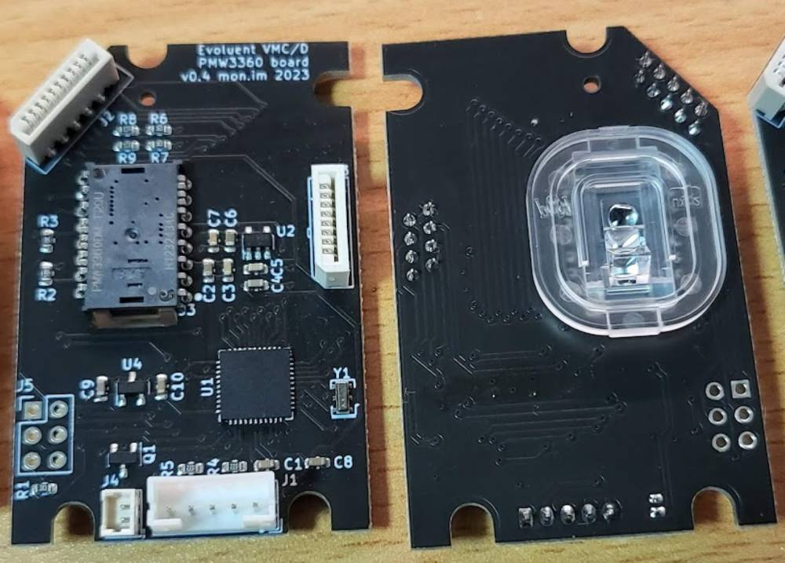
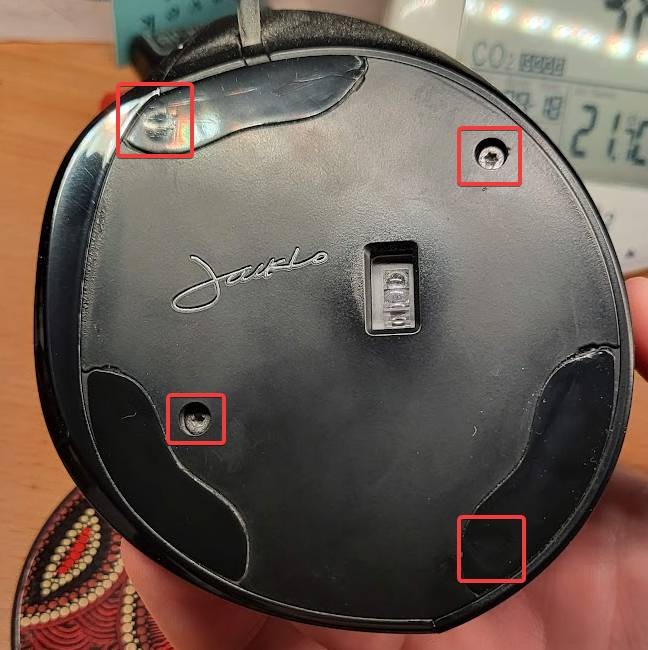
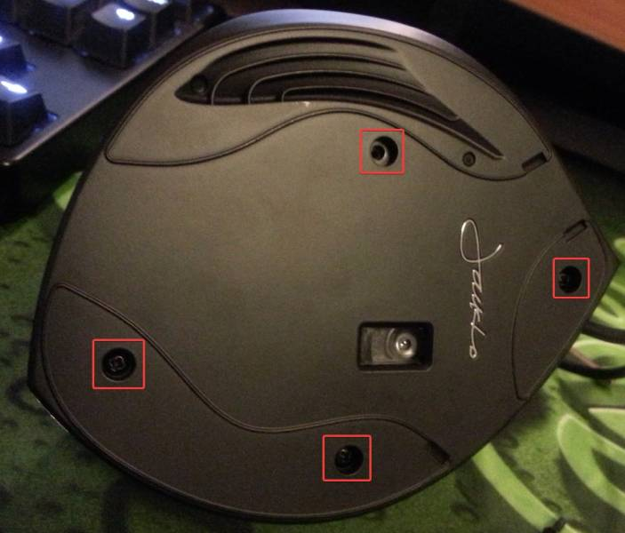
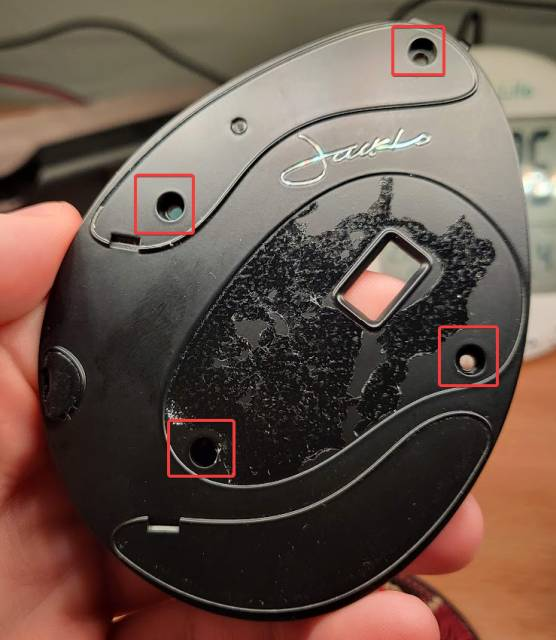

# Evoluent VM4/VMC/VMD better PCB

Let's face it - the sensor that Evoluent ships with the VerticalMouse series of
mice is at best "OK" and recently, dreadful. While my VM4 and the wireless VMC
was "fine, but office-spec", the VMD jitters, jumps, and cannot keep up with
even moderately fast moves across the mousepad.

So, I created this drop-in replacement PCB to upgrade the sensor to a gaming
grade PMW3360DM, using an atmega32u4 and Arduino.

## Supported models
So far this seems to work with
- VMD
- VMC
- VM4 (large and small)

It *may* work with the VM3.

The current design only supports wired models.

## Installation

The PCB has the same shape and pinouts as the stock PCB and is a drop-in replacement.

### Step 1
Remove the bottom off your mouse - this unfortunately requires
taking some of the non-slip feet off. Be as careful as possible to not mangle
the feet when you remove them, or you will significantly affect the smooth feel
of the mouse.

**It is normal for surface smoothness to be poor after you replace the feet.
When I upgraded my VMD, it took 2-3 weeks to return to normal feeling.**

For the **Large** VerticalMouse D, the screws (some of which are Torx security
bits) are located here: 

For the VerticalMouse **C**, the screws are located here:  

For the **Small** VerticalMouse 4, the screws are located here:  

### Step 2
With the bottom of the mouse removed, unplug all cables from the existing PCB.

The USB cable (the one located at the back of the PCB) can take a fair amount of
force to remove. Ensure you grip at the base of the cable to avoid damage.

The ribbon cables must also be gripped at the base when removing/replacing them,
as they are more fragile than normal cables.

## Step 3
Unscrew and remove the existing PCB. The screws are located here:

## Step 4
Repeat the disassembly steps in reverse.

## Step 5 (Optional)
For shipped PCBs: If the default firmware is not to your liking, customise it
using the Arduino toolchain. See the "Firmware" section (you can skip the
bootloader as the PCB ships with one).

For PCBs you make yourself: You need to flash the bootloader and firmware, see
the "Firmware" section.

## Firmware

- Using the ICSP pins on the left of the PCB, flash the atmega with the Arduino
  Leonardo bootloader.
- Install the AdvMouse library from the [PMW3360_Arduino
  repository](https://github.com/SunjunKim/PMW3360_Arduino)
- Customise your button layout in the struct `button_t buttons[]`.
  - The pin map is:
  - 10: Top mouse button
  - 6: Middle mouse button
  - 4: Lower mouse button
  - 12: Scrollwheel click (for mice that have one)
  - A0: Lower thumb button
  - 2: Upper thumb button
  - (Thumb button pins are reversed on the VMC)
  - 8: Sensitivity/DPI button
- (Optional) Adjust the DPI increments in `dpi_steps[]`
- (Optional) If your buttons are chattery and double-clicking when they
  shouldn't, increase `DEBOUNCE` from 20 to some higher number, such as 50.
- (Optional) Rename the mouse's device name using the `USBRename` line. The
  default is `Evoluent VMD` with manufacturer `mon.im`.
- flash evoluent_better_pcb.ino, selecting Arduino Leonardo as the device type.

I recommend using Device Manager to assign a very high COM port number to the
mouse - that way, you won't accidentally reflash the mouse when working with
other Arduino projects.

The default firmware is basic, but functional. It is based on PMW3360_Arduino's
PMW3360DM-Mouse example and extended for my own uses. It has a serial interface
to configure mouse parameters which is useful when nailing down your preferred
DPI.

The default DPI is the second entry in the list. Clicking the DPI button when
the DPI indicator LEDs are off will show the current DPI. Clicking again within
5 seconds will move the selected DPI through the list. This does not persist
over a power cycle.

## The PCB

It uses the recommended circuit for the PMW3360, with a 1.8v core voltage and
3.3v IO voltage, with the Arduino also running at 3.3v (not 5v).

The PCB is in the `evoluent` subfolder. There are gerbers in `evoluent/production`.

## Assembly/BOM

There is a full BOM csv in `evoluent/production`.

The PMW3360DM (with lens) can be easily bought from aliexpress for about $10
USD.

The FPC connectors for the buttons can be any thru-hole soldered, 1mm pitch
connector. The schematic has the JST 08FMZ-BT/10FMZ-BT, but I ended up buying
something else.

The USB connector is compatible with JST-PH.

The other components are fairly standard, and if the 3v3/1v8 regulators are
unavailable, there will be pin-compatible replacements easily available.

## Support

I use this PCB in my mouse daily. I have been running it for almost 2 years now
without issues, so please get in contact if you are having problems.

You are free to manufacture this PCB and sell it on Tindie etc, just remember to
provide attribution :)
